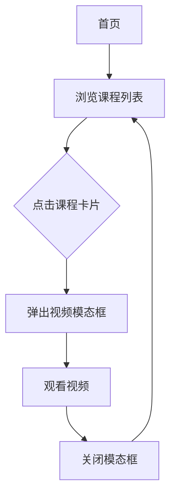

## 1. 产品概述
CodeeBot 视频课程中心是一个现代化的在线学习平台，专为AI硬件产品用户提供视频教程服务。通过融合CodeeBot品牌科技感和Datawhale社区极简设计风格，为用户提供清晰、高效的学习体验。

目标用户：CodeeBot产品用户、AI编程爱好者、教育工作者
市场价值：建立完整的产品生态，提升用户学习体验和品牌忠诚度

## 2. 核心功能

### 2.1 用户角色
本阶段暂不需要用户注册和角色区分，所有访问者均可浏览课程内容。

### 2.2 功能模块
课程中心包含以下核心页面：
1. **首页**：包含导航栏、主视觉区、课程列表区
2. **视频播放页**：模态框形式的视频播放界面

### 2.3 页面详情
| 页面名称 | 模块名称 | 功能描述 |
|---------|---------|----------|
| 首页 | 顶部导航栏 | 显示CodeeBot Learning Logo和导航链接，采用毛玻璃效果 |
| 首页 | 主视觉区 | 居中显示主标题"和 CodeeBot 一起学用 AI"和副标题介绍 |
| 首页 | 课程网格 | 响应式网格布局展示课程卡片，支持悬停效果 |
| 课程卡片 | 视频封面 | 显示课程预览图和悬浮播放按钮 |
| 课程卡片 | 课程信息 | 显示课程标签、标题和简介 |
| 视频播放 | 模态框 | 黑色遮罩层，包含关闭按钮和iframe视频容器 |

## 3. 核心流程
用户访问流程：
1. 用户进入首页 → 浏览课程列表 → 点击课程卡片 → 弹出视频播放模态框 → 观看视频 → 关闭模态框

## 4. 用户界面设计

### 4.1 设计风格
- **主色调**：CodeeBot品牌蓝 (#2b5cff)
- **辅助色**：蓝灰渐变背景
- **按钮风格**：圆角设计，悬停状态变化
- **字体**：现代无衬线字体，标题大字号，正文字号适中
- **布局风格**：极简主义，卡片式布局，大阴影效果
- **图标风格**：使用lucide-react图标库，线条简洁

### 4.2 页面设计概述
| 页面名称 | 模块名称 | UI元素 |
|---------|---------|--------|
| 首页 | 导航栏 | 毛玻璃背景(backdrop-blur)，白色文字，Logo居左，导航链接居右 |
| 首页 | 主视觉区 | 蓝灰渐变背景，白色文字居中，主标题36px加粗，副标题18px |
| 首页 | 课程网格 | CSS Grid布局，3列(PC)/2列(平板)/1列(手机)，间距24px |
| 课程卡片 | 整体 | 白色背景，圆角12px，阴影hover时加深，轻微上浮动画 |
| 课程卡片 | 封面区 | 16:9比例，灰色占位背景，中央播放图标按钮 |
| 课程卡片 | 信息区 | 内边距16px，标签小字号，标题18px加粗，简介14px |
| 视频模态框 | 遮罩层 | 黑色半透明背景，居中白色容器，圆角8px |
| 视频模态框 | 视频区 | 16:9比例iframe，支持B站/YouTube嵌入 |

### 4.3 响应式设计
- **桌面端优先**：基础设计以PC端为主
- **断点设置**：768px(平板)、640px(手机)
- **触控优化**：按钮和交互元素适合触摸操作
- **性能考虑**：图片懒加载，组件按需渲染

### 4.4 关键约束
1. **技术栈约束**：必须使用Next.js (App Router) + React + TypeScript + Tailwind CSS
2. **品牌一致性**：严格遵循CodeeBot品牌蓝色和"Snap, Code, Play"文案风格
3. **性能要求**：首屏加载时间<3秒，支持现代浏览器(Chrome, Firefox, Safari, Edge)