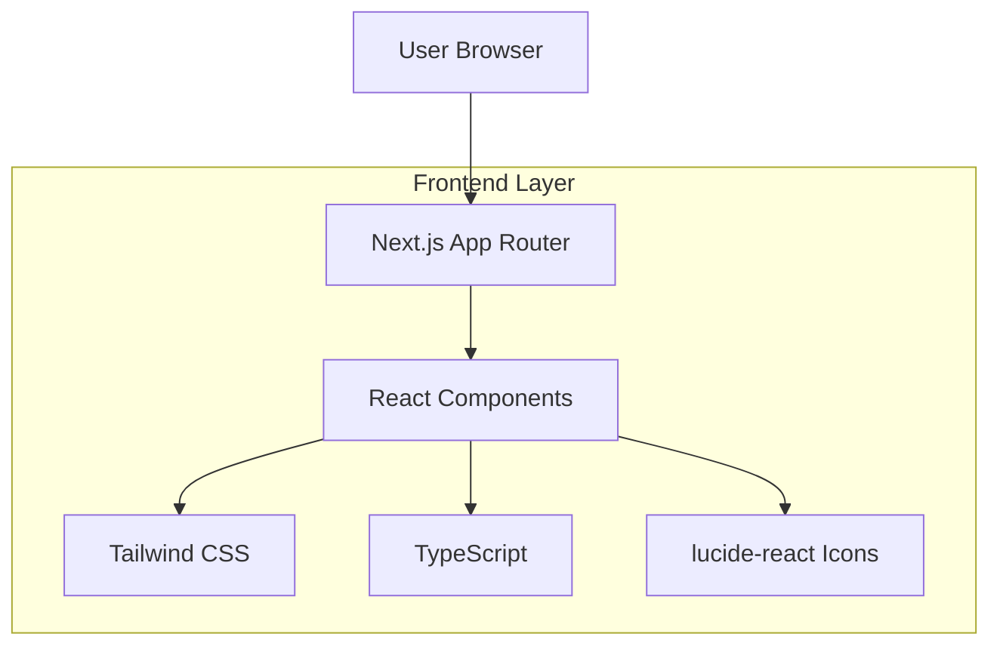

## 1. 架构设计



## 2. 技术描述

- **前端框架**：Next.js 14 (App Router) + React 18 + TypeScript
- **样式方案**：Tailwind CSS 3.4
- **图标库**：lucide-react
- **初始化工具**：create-next-app
- **构建工具**：Next.js 内置构建系统
- **包管理**：npm/yarn/pnpm

## 3. 路由定义

| 路由 | 用途 |
|------|------|
| `/` | 首页，展示课程列表和主视觉区 |
| `/course/[id]` | 课程详情页（预留） |
| `/api/courses` | 课程数据API（如需要） |

## 4. 组件架构

### 4.1 核心组件结构
```
src/
├── app/
│   ├── layout.tsx          # 根布局组件
│   ├── page.tsx            # 首页组件
│   └── globals.css         # 全局样式
├── components/
│   ├── Header.tsx          # 顶部导航栏
│   ├── Hero.tsx            # 主视觉区
│   ├── CourseGrid.tsx      # 课程网格容器
│   ├── CourseCard.tsx      # 课程卡片
│   └── VideoModal.tsx      # 视频播放模态框
├── types/
│   └── course.ts           # 课程数据类型定义
└── data/
    └── courses.ts          # 模拟课程数据
```

### 4.2 关键类型定义

```typescript
// types/course.ts
export interface Course {
  id: string;
  title: string;
  description: string;
  lesson: string;
  thumbnail: string;
  videoUrl: string;
  duration: string;
  level: 'beginner' | 'intermediate' | 'advanced';
}

export interface VideoModalProps {
  isOpen: boolean;
  onClose: () => void;
  videoUrl: string;
  title: string;
}
```

## 5. 状态管理

- **本地状态**：使用React useState管理模态框开关状态
- **数据流**：父组件向子组件传递props，无复杂全局状态
- **交互状态**：课程卡片hover状态由CSS处理

## 6. 样式系统

### 6.1 Tailwind配置要点
```javascript
// tailwind.config.js
module.exports = {
  content: [
    './src/pages/**/*.{js,ts,jsx,tsx,mdx}',
    './src/components/**/*.{js,ts,jsx,tsx,mdx}',
    './src/app/**/*.{js,ts,jsx,tsx,mdx}',
  ],
  theme: {
    extend: {
      colors: {
        'codeebot-blue': '#2b5cff',
        'glass-white': 'rgba(255, 255, 255, 0.1)',
      },
      backdropBlur: {
        xs: '2px',
      },
      animation: {
        'float': 'float 3s ease-in-out infinite',
      },
    },
  },
  plugins: [],
}
```

### 6.2 响应式断点
- `sm`: 640px
- `md`: 768px  
- `lg`: 1024px
- `xl`: 1280px
- `2xl`: 1536px

## 7. 性能优化

- **图片优化**：使用Next.js Image组件处理课程封面
- **代码分割**：组件级代码分割，按需加载
- **CSS优化**：Tailwind CSS自动移除未使用样式
- **字体优化**：使用系统字体栈，减少网络请求

## 8. 浏览器兼容性

- **支持浏览器**：Chrome 88+, Firefox 85+, Safari 14+, Edge 88+
- **polyfill**：Next.js自动处理必要的polyfill
- **降级处理**：CSS Grid不支持的浏览器使用Flexbox回退

## 9. 开发约束

1. **代码规范**：使用TypeScript严格模式，所有组件必须类型化
2. **样式约束**：仅使用Tailwind CSS类名，禁止内联样式和CSS文件
3. **组件化**：每个UI元素必须拆分为独立组件，保持单一职责原则
4. **中文注释**：关键逻辑必须包含中文注释，便于后续维护